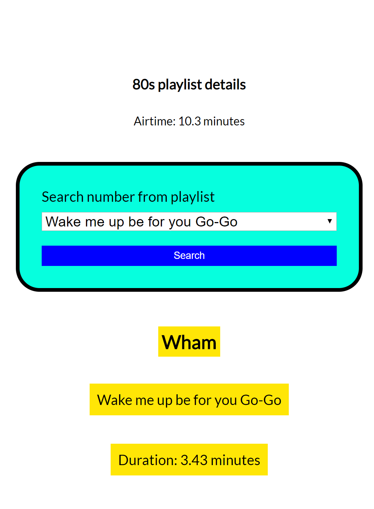

# Casustoets

* starttijd: 09.00 uur
* eindtijd: 12.00 uur
* hulpmiddelen: internet, huiswerk en voorbeelden uit les. Het is uitdrukkelijk verboden om sociale media in te zetten en contact te zoeken met anderen.
* eigenaarschap: de code die je hebt opgeleverd is door jou ontwikkeld.
* inleveren: lever via learn een .zip bestand in van al je bestanden.

## Casusomschrijving



Gegeven is de HTML en CSS (zie map start) van het bovenstaande plaatje. In dit plaatje zie je een overzicht van een favoriete 80s playlist. Onder de playlist ntitel staat de totale tijd van de playlist (airtime). Dit is een optelling van de tijd van elk liedje afzonderlijk. Dit moet je zelf berekenen en op de juiste manier op de plek in het DOM zetten. De tijd die er nu staat is een placeholder. In het formulier kun een liedje van de playlist selecteren. Als een je een liedje selecteert en op submit (search) drukt worden de details van het liedje in het `div` met het id `number-details` getoond. De details moeten op de volgende manier in het DOM worden gezet.

``` 
<h1 id="artist" class="bg-yellow">name-of-artist</h1>
<p id="number" class="bg-yellow">name-of-the-song</p>
<p id="duration" class="bg-yellow">duration-of-the-song</p>
```

Deze opmaak moet je gebruiken om zelf de elementen te creeeren wanneer er op submit is gedrukt. 

De HTML en CSS voor deze opdracht is gegeven en staat in de map 'start'.

De liedjes zijn opgenomen in het volgende object met een array van nummers.

``` 
//global variables
const myPlayList = {
    name: 'My Favourite 80s tracks',
    numbers: [
        {
            name: 'Wake me up be for you Go-Go',
            duration: 3.43,
            artist: 'Wham'
        },
        {
            name: 'Never gonna give you up',
            duration: 3.30,
            artist: 'Rick Astley'
        },
        {
            name: 'The final countdown',
            duration: 3.57,
            artist: 'Europa'
        }
    ]
}
```

## Nakijkcriteria

1. Je mag geen jQuery gebruiken, alleen native JavaScript. Wanneer er wel jQuery wordt gebruikt dan wordt de opdracht niet nagekeken.
2. Je applicatie wordt alleen nagekeken op het moment dat de waardes uit het invoervelden worden vergeleken met de categorien en er een bericht wordt geschreven naar de DOM.
3. Je kunt voor de 10 gaan door de opdracht volledig af te maken.

## Beoordelingscriteria

| Nr  | Leeropbrengsten                                                                        | Punten |
|-----|----------------------------------------------------------------------------------------|--------|
| 1   | Gebruikt consistente naamgeving                                                        | 5      |
| 2   | Gebruikt const, let, var in de gevraagde situatie                                      | 5      |
| 3   | Gebruikt array's om data in op te slaan                                                | 5      |
| 4   | Gebruikt een conditional (if else)                                                     | 10     |
| 5   | Gebruikt een loop om herhaling van stappen te voorkomen                                | 10     |
| 6   | Schrijft een functie om code te structureren                                           | 10     |
| 7   | Schrijft een functie om herhaling te voorkomen                                         | 5      |
| 8   | Schrijft commentaar volgens de JS docs richtlijnen                                     | 5      |
| 9   | Gebruikt de juiste operatoren bij vergelijkingen                                       | 5      |
| 10  | Gebruikt console.log om te debuggen                                                    | 5      |
| 11  | Gebruikt een object om gestructureerde data in op te slaan                             | 5      |
| 12  | Gebruikt Events voor interactie                                                        | 10     |
| 13  | Gebruikt DOM methods (interfaces) om HTML elementen te maken en te plaatsen in het DOM | 10     |
| 14  | Gebruikt DOM methods (interfaces) methoden om door de DOM te wandelen                  | 10     |

## Puntenverdeling

| Beoordeling    | Cijfer | Aantal punten |
|----------------|--------|---------------|
| onvoldoende    | 4      | < 60          |
| matig          | 5      | 60 tot 70     |
| voldoende      | 6      | 70 tot 80     |
| ruim voldoende | 7      | 80 tot 85     |
| goed           | 8      | 85 - 90       |
| zeer goed      | 9      | 90 - 95       |
| uitmuntend     | 10     | 95 - 100      |

